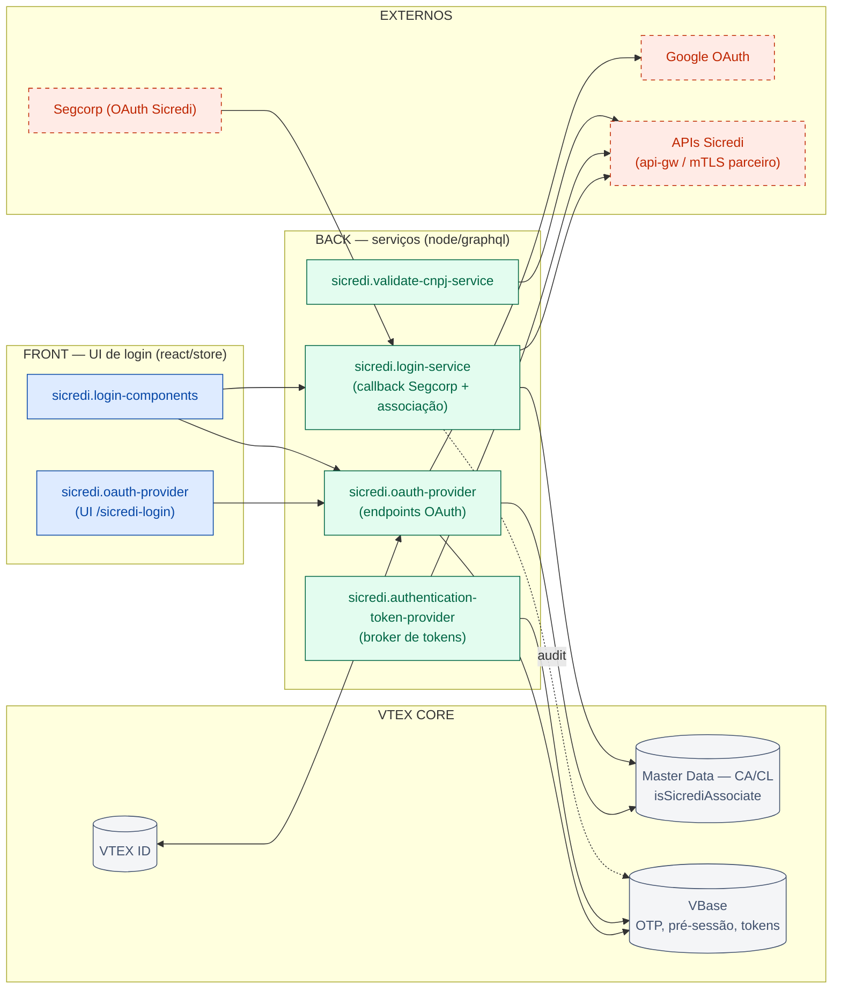
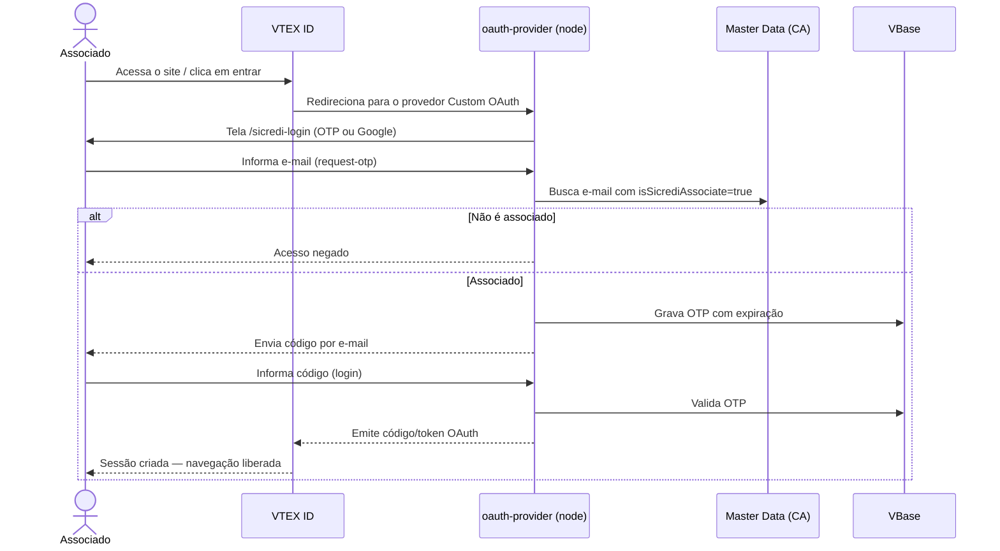
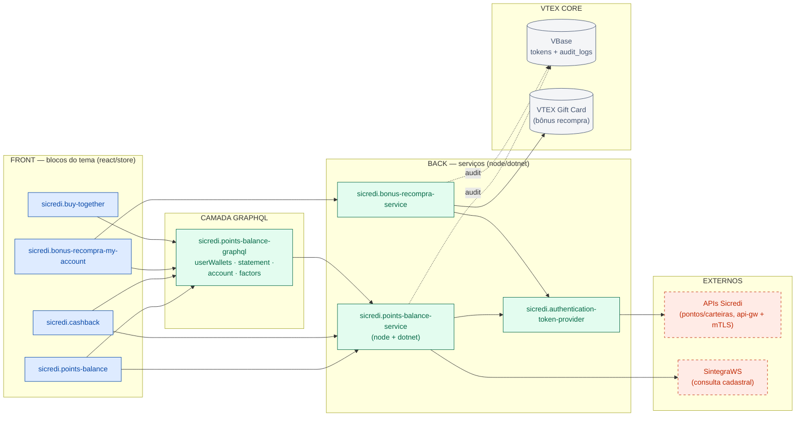
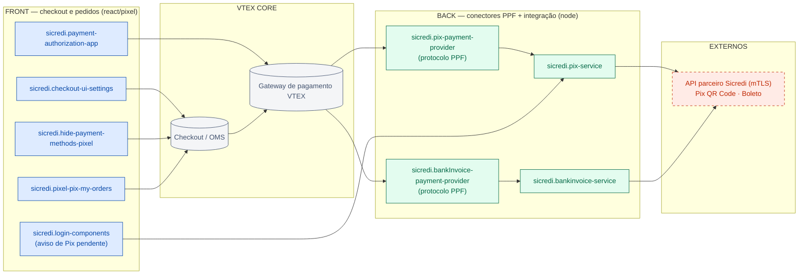
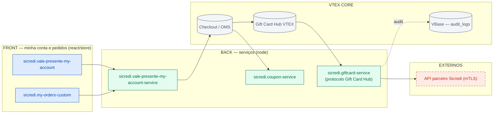
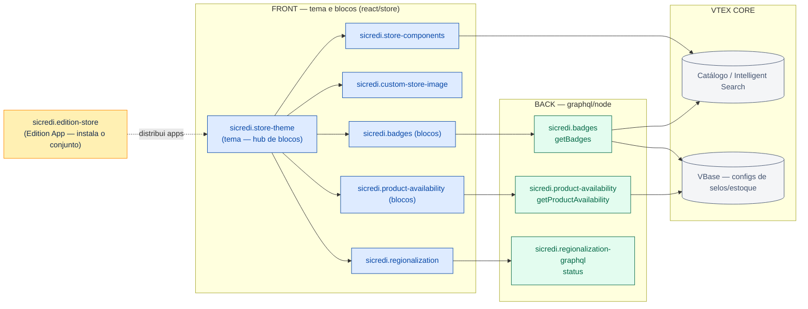
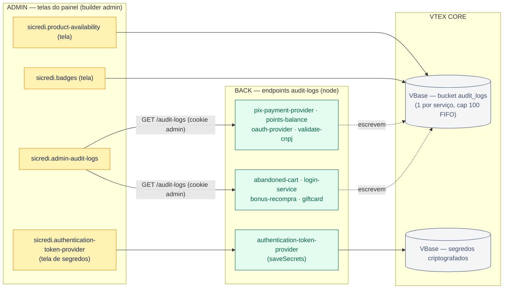
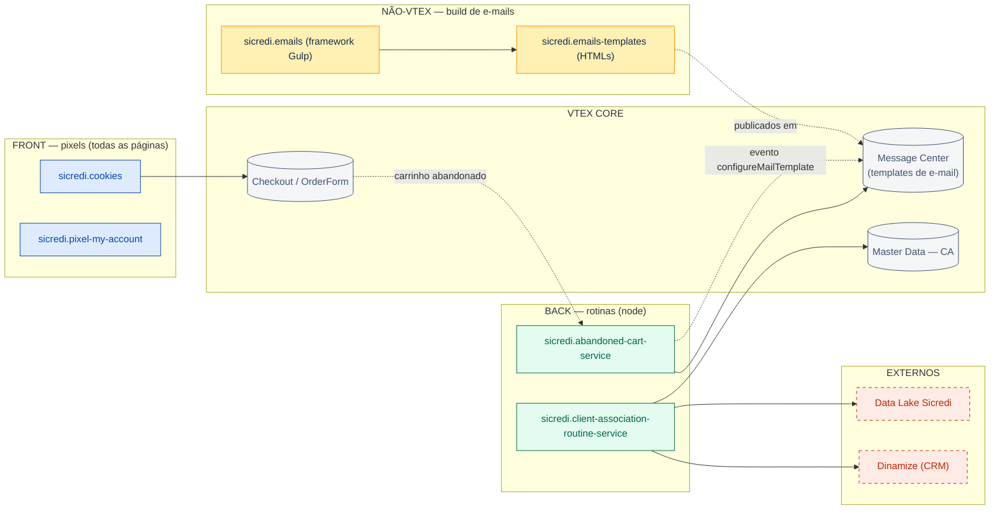

# Shopping Sicredi — Domínios Funcionais e Fluxogramas

> Página filha de [ONBOARDING.md](./ONBOARDING.md). Um capítulo por domínio: o que faz, quais rotas/queries cada serviço expõe, quem chama o quê, e o fluxograma do domínio.

**Convenção dos diagramas:** 🔵 azul = front-end (`react`/`store`/`pixel`) · 🟢 verde = back-end (`node`/`dotnet`/`graphql`) · 🟡 amarelo = admin · ⬜ cilindro cinza = armazenamento/serviço VTEX · 🔴 tracejado vermelho = sistema externo. Setas sólidas = chamadas síncronas; pontilhadas = rotinas/eventos/auditoria. Apps com front **e** back aparecem duplicados (sufixo no rótulo indica a parte). Se o Confluence não renderizar Mermaid, use os SVGs em [`diagrams/`](./diagrams/).

**Sumário:** [D1 Autenticação](#d1--autenticação-e-login) · [D2 Pontos/Cashback](#d2--pontos-cashback-e-bônus) · [D3 Pagamentos](#d3--pagamentos-pix-e-boleto) · [D4 Vale-presente](#d4--vale-presente-gift-card-e-cupom) · [D5 Vitrine](#d5--vitrine-catálogo-e-regionalização) · [D6 Admin](#d6--admin-e-auditoria) · [D7 Rotinas](#d7--rotinas-e-mails-e-pixels-de-suporte)

---

## D1 — Autenticação e Login

O domínio mais importante do projeto: é ele que garante que **só associados Sicredi** entram no site.

**Como funciona:** o VTEX ID delega o login ao provedor customizado `sicredi.oauth-provider` (protocolo Custom OAuth). A tela de login (`/sicredi-login`) oferece dois caminhos — **código por e-mail (OTP)** ou **Google** — e nos dois o e-mail é validado contra a entidade `CA` do Master Data (`isSicrediAssociate=true`). Em paralelo, o `sicredi.login-service` cuida da **associação pós-login**: é o alvo do callback OAuth do **Segcorp** (provedor de identidade corporativo Sicredi), troca o código por token, lê os dados do associado no JWT, consulta as contas na API de parceiro (mTLS) e registra a associação nas entidades `CA`/`CL`.

O `sicredi.authentication-token-provider` é o **broker de tokens** das APIs corporativas Sicredi: nenhum serviço guarda credenciais próprias — todos pedem o token a ele (cache no VBase, segredos criptografados com AES-128-CBC, roteamento `sicrediqa`→UAT automático). A tela admin dele (cadastro de segredos) está no capítulo [D6](#d6--admin-e-auditoria).

### Rotas e queries

| App | Expõe | Observação |
| --- | --- | --- |
| `oauth-provider` (node) | `/_v/private/sicredi/oauth/{authorize, request-otp, login, token, userinfo, config, presession}` · `/_v/private/sicredi/oauth/google/{start, callback}` · `/_v/sicredi/oauth/keep-alive` · `openapi.json`, `docs`, `audit-logs` | Endpoints do protocolo OAuth consumidos pelo VTEX ID e pela própria UI de login |
| `login-service` (node) | `/login-callback` · `/_v/private/app/login/authorization` · `/_v/private/passwordless/generate/authentication` · `/_v/private/restricted/seller/:sellerId` · `/_v/private/profile` · `/_v/private/audit-logs` | `/login-callback` é o retorno do OAuth Segcorp |
| `login-service` (graphql) | Query `restrictedSellers(sellerId)` | Consumida por `login-components` |
| `authentication-token-provider` (node) | `/_v/auth-token` · `/_v/auth-token/invalidate` · `/_v/proxy/*url` — **todas privadas** | Chamadas apenas por outros serviços |
| `validate-cnpj-service` (node) | `/_v/private/validate/CNPJ/:cnpj` · `audit-logs` | Validação cadastral de CNPJ (usada no fluxo de compra PJ) |

### Quem chama o quê

| Origem (front) | Destino | Via |
| --- | --- | --- |
| `oauth-provider` (UI de login) | `oauth-provider` (node) | `config`, `request-otp`, `login`, `google/start`, `presession` |
| `login-components` | `oauth-provider` (node) | `presession`, `keep-alive` |
| `login-components` | `login-service` | `/_v/private/app/login/authorization` · Query `restrictedSellers` |
| `store-components` | `login-service` / `oauth-provider` | `passwordless` · `presession` |

### S1 — Sequência do gate de login (OTP por e-mail)

---

## D2 — Pontos, Cashback e Bônus

O associado consulta **saldo e extrato de pontos**, vê **fatores de conversão** (quantos pontos valem um produto) e recebe **cashback/bônus recompra**. Os dados vêm das APIs corporativas Sicredi — sempre via token do `authentication-token-provider`.

A camada GraphQL (`points-balance-graphql`) é a porta de entrada preferida do front; alguns blocos também chamam rotas REST do `points-balance-service` diretamente. O **bônus recompra** é um cashback promocional creditado como gift card VTEX — por isso o `bonus-recompra-service` expõe rotas de `giftcard` por usuário.

### Rotas e queries

| App | Expõe |
| --- | --- |
| `points-balance-graphql` | Query `userWallets(documentNumber, creditUnion)` · `statement(walletId)` · `account(documentNumber)` · `factors` |
| `points-balance-service` (node) | `/_v/{factors, legacy-factors, wallet, statement}` · `/redeem-cashback` · `/cashback-cards` · `/update-orderform` · `/_v/private/points-balance/{wallet, points-to-expire, statement}` · `/_v/private/factors/:factorCategory` · `/_v1/private/middleware/getDataSintegra{RF,SN,ST,CPF}` · `audit-logs` |
| `points-balance-service` (dotnet) | `/_v/dotnet/test` (módulo .NET auxiliar) |
| `bonus-recompra-service` (node) | `/_v/private/giftcard/{balance, transactions}/:userId` · `/_v/private/cashback/settings[/:status]` · `/_v/private/cashback/settings/token/invalidate` · `audit-logs` |

### Quem chama o quê

| Origem (front) | Destino | Via |
| --- | --- | --- |
| `points-balance` | `points-balance-service` | `/_v/factors`, `/_v/wallet`, `/_v/statement` |
| `cashback` | `points-balance-service` | `/_v/private/factors/{CASHBACK,PRODUTOS}`, `/_v/private/points-balance/wallet` |
| `bonus-recompra-my-account` | `bonus-recompra-service` | `/_v/private/giftcard/{balance,transactions}/` |
| `store-components` | `points-balance-service` / `bonus-recompra-service` | `/_v/wallet` · `/_v/private/cashback/settings` |
| `points-balance`, `cashback`, `bonus-recompra-my-account`, `buy-together`, `vale-presente-my-account`, `login-components` | `points-balance-graphql` | Queries `account`, `userWallets`, `statement`, `factors` |

---

## D3 — Pagamentos (Pix e Boleto)

Pix e boleto são processados **pelos sistemas da própria Sicredi**. Para cada meio de pagamento existe um par de apps:

- O **conector PPF** (`pix-payment-provider`, `bankInvoice-payment-provider`) implementa o protocolo do gateway VTEX: o gateway chama as rotas padronizadas (`payments`, `cancellations`, `settlements`, `refunds`) durante o ciclo de vida do pagamento.
- O **serviço de integração** (`pix-service`, `bankinvoice-service`) replica essas operações contra a API de parceiro Sicredi (mTLS) — gerando QR Code Pix ou o boleto.

No front, o checkout é ajustado por `checkout-ui-settings` (customizações de UI do checkout), `payment-authorization-app` (página de autorização de pagamento), `hide-payment-methods-pixel` (esconde meios de pagamento conforme regra) e `pixel-pix-my-orders` (mostra Pix pendente nos pedidos). O bloco de login também avisa sobre **Pix pendente** (`/_v/private/pix/pending`).

### Rotas

| App | Expõe |
| --- | --- |
| `pix-payment-provider` | `/_v/api/pix/manifest` · `/_v/api/pix/payments[/:paymentId/{cancellations, settlements, refunds}]` · `audit-logs` |
| `pix-service` | `/pix/{payment-methods, manifest, payments...}` (espelho do protocolo) · `/_v/private/pix/pending` |
| `bankInvoice-payment-provider` | `/_v/api/bankinvoice/payments[...]` · `/_v/api/bankinvoice/:code` (PDF do boleto) |
| `bankinvoice-service` | `/bankinvoice/{payment-methods, manifest, payments...}` |

---

## D4 — Vale-presente, Gift card e Cupom

O associado compra **vale-presente** e o presenteado resgata na loja. A área "Minha conta" tem uma seção dedicada (`vale-presente-my-account`) e a página de pedidos é customizada (`my-orders-custom`) para exibir os gift cards de cada pedido.

- `vale-presente-my-account-service` concentra as consultas: lista de vales por usuário/e-mail, detalhe, transações, resgate por código e também consultas de **cupom** (uso e detalhe).
- `giftcard-service` implementa o protocolo de **Gift Card Hub** da VTEX (`/giftcards/_search`, transações, autorizações, cancelamentos, liquidações) — é ele que o Checkout consulta quando o associado paga com vale/bônus.
- `coupon-service` expõe `/coupon-validator` para validação de cupons no fluxo de compra.

### Rotas

| App | Expõe |
| --- | --- |
| `vale-presente-my-account-service` | `/_v/private/valepresente/{getIDbyRedemptionCode, getDetailByID, list, transactions, getGiftcardsByEmail, getGiftcardsByOrderIds[WithoutAuth]}` · `/_v/private/orderDetail/:orderId` · `/_v/private/coupon/{getCoupon, getCouponUsageCount}/:id` |
| `giftcard-service` | `/giftcards/_search` · `/giftcards/:id[/transactions/:tid/{authorization, cancellations, settlements}]` · `audit-logs` |
| `coupon-service` | `/coupon-validator` |

### Quem chama o quê

| Origem (front) | Destino | Via |
| --- | --- | --- |
| `vale-presente-my-account` | `vale-presente-my-account-service` | `getDetailByID`, `getGiftcardsByEmail`, `getIDbyRedemptionCode`, `transactions`, `orderDetail` |
| `my-orders-custom` | `vale-presente-my-account-service` | `getGiftcardsByOrderIds` |
| Checkout VTEX | `giftcard-service` / `coupon-service` | protocolo Gift Card Hub · `/coupon-validator` |

---

## D5 — Vitrine, Catálogo e Regionalização

O **`store-theme`** é o tema da loja (Store Framework): só blocos declarativos, sem código próprio — ele compõe os blocos dos demais apps. É o maior "hub" de dependências do workspace.

- `store-components` — coleção de componentes de vitrine customizados (simulador de frete, busca, sessão etc.).
- `custom-store-image` — componentes de imagem.
- `badges` *(misto + admin)* — selos/flags configuráveis em produtos por filtro de busca; a configuração é feita numa tela admin e servida ao front via GraphQL (`getBadges`).
- `product-availability` *(misto + admin)* — contador/aviso de estoque por faixas, mesmo padrão do badges (`getProductAvailability`).
- `regionalization` + `regionalization-graphql` — experiência regionalizada por cooperativa (a camada GraphQL expõe `status(statusCode)`).
- `edition-store` — Edition App: o pacote que define quais apps são instalados na conta.

### Queries

| App | Expõe |
| --- | --- |
| `badges` (graphql) | Query `getBadges` · Mutation `saveBadges`, `clearAll` (admin) |
| `product-availability` (graphql) | Query `getProductAvailability` · Mutation `saveProductAvailability`, `clearAll` (admin) |
| `regionalization-graphql` | Query `status(statusCode)` |

---

## D6 — Admin e Auditoria

Telas dentro do painel administrativo VTEX (`/admin/...`), usadas pela operação — o associado nunca as vê:

| Tela admin | App | O que faz |
| --- | --- | --- |
| `/admin/app/sicredi-audit-logs` | `admin-audit-logs` | Visualiza os logs de auditoria de **todos** os serviços |
| `/admin/app/auth-token-provider` | `authentication-token-provider` | Cadastro dos segredos OAuth Sicredi (Mutation `saveSecrets` / Query `getSavedSecretsStatus`) |
| `/admin/app/badges` | `badges` | Configura selos/flags de produto |
| `/admin/app/product-availability` | `product-availability` | Configura o contador de estoque |

O `admin-audit-logs` chama o endpoint `audit-logs` de cada serviço com o **cookie de admin do operador** (`credentials: 'include'`) — não há conta de serviço. Fontes lidas hoje: `abandoned-cart-service`, `login-service`, `bonus-recompra-service` (cashback), `giftcard-service`, `pix-payment-provider`, `points-balance-service`, `oauth-provider` e `validate-cnpj-service`. Todos gravam no mesmo shape, no bucket VBase `audit_logs` do próprio app (máx. 100 entradas, FIFO) — ver [ONBOARDING.md §4.3](./ONBOARDING.md#43-logs-de-auditoria-compartilhados).

---

## D7 — Rotinas, E-mails e Pixels de suporte

Apps de apoio que não pertencem a um fluxo de compra específico:

- **`abandoned-cart-service`** — captura carrinhos abandonados (`/_v/abandoned-cart`) e dispara e-mail de recuperação; tem um event handler (`configureMailTemplate`) que instala o template de e-mail no setup do app. Fala com o BFF da plataforma de shopping Sicredi e com a API de parceiro.
- **`client-association-routine-service`** — rotinas de exportação de dados de associados para o **Data Lake** Sicredi (`/marketplace-datalake/v1/user`) e para o **Dinamize** (CRM/e-mail marketing, `/marketplace-dinamize/v1/user`). Lê a entidade `CA`.
- **`emails`** / **`emails-templates`** *(não-VTEX)* — framework Gulp + Handlebars + SASS que gera os HTMLs dos e-mails transacionais (cashback, cancelamento, comprou-voltou...) publicados no Message Center da VTEX.
- **`cookies`** *(pixel)* — gestão de cookies/consentimento em todas as páginas.
- **`pixel-my-account`** *(pixel)* — ajustes nos campos da página "Minha conta".

