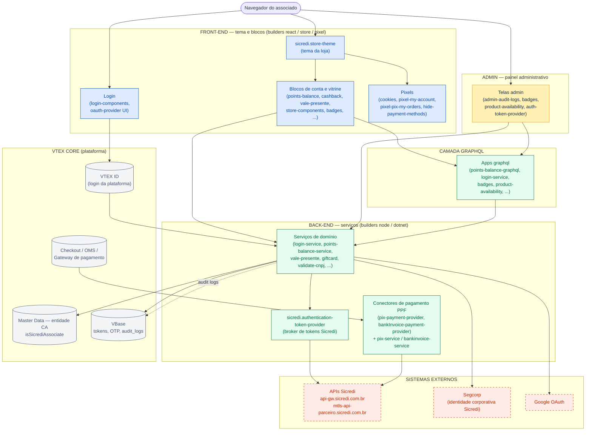

# Shopping Sicredi — Onboarding Técnico

> Documentação de onboarding do e-commerce **[shopping.sicredi.com.br](https://shopping.sicredi.com.br/)**, construído sobre a plataforma **VTEX IO**. Escrita para dois públicos: desenvolvedores novos no projeto e pessoas que não conhecem o ecossistema VTEX.

**Páginas desta documentação:**

| Página | Conteúdo |
| --- | --- |
| **ONBOARDING.md** (esta página) | Visão geral do negócio, glossário VTEX, arquitetura compartilhada e diagrama macro |
| [ONBOARDING-DOMINIOS.md](./ONBOARDING-DOMINIOS.md) | Um capítulo por domínio funcional, com rotas, queries e fluxograma de cada um |
| [ONBOARDING-CATALOGO.md](./ONBOARDING-CATALOGO.md) | Tabela de referência com todos os repositórios `sicredi.*` |

---

## Sumário

1. [O que é o projeto](#1-o-que-é-o-projeto)
2. [Glossário VTEX mínimo](#2-glossário-vtex-mínimo)
3. [Como o código está organizado](#3-como-o-código-está-organizado)
4. [Arquitetura compartilhada](#4-arquitetura-compartilhada)
5. [Mapa de domínios funcionais](#5-mapa-de-domínios-funcionais)
6. [Repositórios não-VTEX](#6-repositórios-não-vtex)
7. [Dia a dia de desenvolvimento](#7-dia-a-dia-de-desenvolvimento)
8. [Diagrama macro — visão por camadas](#8-diagrama-macro--visão-por-camadas)

---

## 1. O que é o projeto

O **Shopping Sicredi** é um e-commerce **exclusivo para associados Sicredi**. Não é uma loja aberta ao público: para navegar e comprar é preciso ser associado de uma cooperativa Sicredi.

### O gate de entrada

Todo o acesso ao site é controlado por um cadastro na entidade **`CA` do Master Data** (a base de dados de clientes da VTEX). Só entra quem tem um registro nessa entidade com o campo **`isSicrediAssociate = true`**. O login é feito por um **provedor OAuth próprio** (`sicredi.oauth-provider`), plugado ao VTEX ID, que oferece dois caminhos: código por e-mail (OTP, sem senha) ou login com Google. Em ambos os casos, o e-mail precisa estar na entidade `CA` como associado — caso contrário o acesso é negado.

> **Nota histórica:** o projeto sofreu tentativas de fraude no fluxo de compra. Foram avaliadas algumas abordagens de mitigação, e a solução definitiva foi a criação desse provedor OAuth customizado, que move a barreira de autenticação para antes da navegação e valida a condição de associado direto na entidade `CA`.

### Conceitos de negócio

| Conceito | O que significa no projeto |
| --- | --- |
| **Associado** | Cliente de uma cooperativa Sicredi. Único perfil autorizado a usar o site. |
| **Pontos** | Programa de pontos Sicredi. O associado consulta saldo, extrato e fatores de conversão, e usa pontos como meio de pagamento parcial/total. |
| **Cashback** | Devolução de parte do valor da compra em forma de crédito/pontos. |
| **Bônus recompra** | Cashback promocional: crédito concedido em gift card VTEX para incentivar nova compra. |
| **Vale-presente** | Gift card que o associado compra e presenteia; resgatável na loja. |
| **Regionalização** | A experiência (catálogo/ofertas) considera a cooperativa/região do associado. |
| **Pix e Boleto Sicredi** | Os meios de pagamento Pix e boleto são processados pelos próprios sistemas Sicredi, via conectores de pagamento customizados. |

---

## 2. Glossário VTEX mínimo

Para quem nunca trabalhou com VTEX. Cada termo em uma linha — links para a documentação oficial em [developers.vtex.com](https://developers.vtex.com).

| Termo | O que é |
| --- | --- |
| **VTEX** | Plataforma SaaS de e-commerce. Fornece catálogo, checkout, pedidos (OMS), pagamentos, login (VTEX ID) etc. como serviços gerenciados. |
| **VTEX IO** | Plataforma de desenvolvimento serverless da VTEX. Cada funcionalidade customizada é um **app** que roda na infraestrutura da VTEX — não há servidores próprios neste projeto. |
| **App** | Unidade de código no VTEX IO. Identificado por `vendor.nome@versão` (ex.: `sicredi.login-service@0.16.x`). Cada repositório `sicredi.*` deste workspace é um app. |
| **Vendor / conta** | `sicredi` é o vendor (dono dos apps) e também a conta de produção. `sicrediqa` é a conta de homologação/UAT. |
| **Builder** | Declara *o tipo de código* que um app contém, no `manifest.json`. `react`/`store`/`pixel`/`styles` = front-end; `node`/`dotnet`/`graphql` = back-end; `admin` = telas do painel administrativo; `docs` = documentação (quase todos têm). Um app pode ter vários builders ao mesmo tempo. |
| **manifest.json** | O "RG" do app: nome, versão, builders, dependências de outros apps e políticas de acesso (ex.: quais hosts externos pode chamar). |
| **Workspace (VTEX)** | Ambiente isolado dentro de uma conta para desenvolver/testar (`vtex use dev-fulano`). `master` é o que está no ar. |
| **`vtex link` / `publish` / `deploy`** | Ciclo de vida: `link` roda o app em hot-reload num workspace de dev; `publish` gera uma versão imutável; `deploy` a promove para instalação. |
| **Store Framework** | Front-end de loja da VTEX baseado em **blocos** declarativos (JSONs no tema) implementados por componentes React. O tema (`store-theme`) compõe blocos próprios e de outros apps. |
| **Pixel app** | App que injeta scripts em todas as páginas da loja (analytics, cookies, ajustes globais). Builder `pixel`. |
| **Admin app** | App com telas dentro do painel administrativo VTEX (`/admin/...`). Builder `admin` + componente React. |
| **service.json** | Arquivo do builder `node` que declara as **rotas HTTP** que um serviço expõe (`/_v/...`) e se são públicas ou privadas. |
| **schema.graphql** | Arquivo do builder `graphql` que declara queries/mutations expostas pelo app no GraphQL da loja. O front consome via `useQuery`/`useMutation`. |
| **Master Data** | Banco de dados de entidades da VTEX (estilo documento). Aqui, a entidade **`CA`** guarda os associados. |
| **VBase** | Storage chave-valor por app/workspace. Usado neste projeto como armazenamento efêmero: tokens em cache, OTPs, pré-sessões, logs de auditoria. |
| **OrderForm / Checkout / OMS** | OrderForm é o carrinho; Checkout é o serviço de compra; OMS gerencia os pedidos após fechados. |
| **PPF (Payment Provider Framework)** | Protocolo da VTEX para conectores de pagamento: o gateway VTEX chama rotas padronizadas (`/payments`, `/cancellations`, `/settlements`, `/refunds`) no conector. |
| **App settings** | Configurações de um app editáveis no Admin (Apps > Meus apps). É onde vivem credenciais e parâmetros — nunca no código. |
| **Edition app** | Pacote que agrupa apps e configurações para instalar de uma vez em uma conta (`sicredi.edition-store` faz esse papel). |

---

## 3. Como o código está organizado

O workspace é uma **coleção de repositórios Git independentes**, um por app, todos com o prefixo `sicredi.`. Não existe um monorepo com build centralizado: cada app tem seu próprio `manifest.json`, `package.json` e ciclo de versão, e os comandos são sempre executados dentro da pasta do app.

A separação front/back é dada pelos **builders** do `manifest.json`:

- **Front-end** — builders `react`, `store`, `pixel`, `styles`: blocos do tema, componentes de login, pixels.
- **Back-end** — builders `node`, `dotnet`, `graphql`: serviços HTTP, resolvers GraphQL, conectores de pagamento.
- **Admin** — builder `admin`: telas do painel administrativo (tratadas como uma categoria especial nos diagramas).
- **Mistos** — apps com builders dos dois lados (ex.: `oauth-provider`, `badges`, `product-availability`, `authentication-token-provider`). Nos fluxogramas eles aparecem **duplicados**, uma vez na camada de front e outra na de back.

A lista completa, com a classificação de cada app, está em [ONBOARDING-CATALOGO.md](./ONBOARDING-CATALOGO.md).

---

## 4. Arquitetura compartilhada

Padrões que se repetem em praticamente todos os serviços do projeto.

### 4.1 Stack de autenticação

Dois apps formam o núcleo de identidade:

- **`sicredi.oauth-provider`** — provedor de identidade **Custom OAuth** plugado no VTEX ID. Renderiza a tela de login (rota `/auth/login` da loja), oferece **OTP por e-mail** ou **Google**, e só emite sessão para quem está na entidade `CA` com `isSicrediAssociate=true`. Quem se autentica sem estar aprovado entra em **pré-sessão** (lobby com cookie opaco + registro no VBase, TTL 48h) e é logado silenciosamente quando a aprovação chega. Estado intermediário (OTP, código, token, pré-sessão) vive no VBase com expiração por registro.
- **`sicredi.authentication-token-provider`** — *broker* de tokens OAuth para as **APIs corporativas da Sicredi** (`api-gw.sicredi.com.br` e variantes UAT). Os serviços de back-end dependem dele em vez de guardar credenciais próprias: ele criptografa os segredos (AES-128-CBC) e mantém o access token em cache no VBase com TTL igual ao `expires_in`. O roteamento de ambiente é interno (`sicrediqa` → UAT; demais → produção) — nenhum app deve fixar URL de ambiente.

Complementam o fluxo: **`sicredi.login-service`** (callback OAuth do Segcorp — provedor de identidade corporativo Sicredi — e rotina de associação pós-login, gravando nas entidades `CA`/`CL`), e **`sicredi.login-components`** (UI de login no tema).

### 4.2 Master Data — entidade `CA`

Esquema mínimo do qual os apps dependem:

| Campo | Tipo | Papel |
| --- | --- | --- |
| `email` | string (**indexado**) | Chave de busca do associado |
| `document` | string | Chave de busca alternativa (CPF/CNPJ) |
| `isSicrediAssociate` | boolean | **O gate de acesso ao site** |

Para quase todos os apps a entidade é **somente leitura**. A exceção controlada é o `login-service`, que registra a associação pós-login.

### 4.3 Logs de auditoria compartilhados

Vários serviços gravam logs de auditoria em um formato comum, e o app **`sicredi.admin-audit-logs`** (painel admin) lê todos eles:

- Bucket VBase **`audit_logs`**, separado do bucket principal de cada app.
- Shape comum `AuditLogEntry { timestamp, user?, operation, operationType: 'success'|'warning'|'error'|'other'|'info', message?, details }`.
- Array JSON do mais novo para o mais antigo, limitado a **100 entradas** (corte FIFO na inserção; o `oauth-provider` usa limite maior, de 500).
- Cada serviço expõe `POST /audit-logs` **sem autenticação** (para os apps irmãos cruzarem escrita); `GET`/`DELETE` exigem admin.

Serviços com endpoint de auditoria lidos pelo painel: `abandoned-cart-service`, `login-service`, `bonus-recompra-service`, `giftcard-service`, `pix-payment-provider`, `points-balance-service`, `oauth-provider` e `validate-cnpj-service`. **Qualquer mudança no shape/bucket/limite precisa ser replicada em todos eles e no leitor admin em conjunto.**

### 4.4 VBase como storage efêmero

O padrão de armazenamento do projeto é o **VBase** (não Master Data, não banco externo) para tudo que é de curta duração: tokens em cache, OTPs, pré-sessões, estado de OAuth, logs de auditoria. Cada registro carrega seu próprio `expiresAt`, e a leitura rejeita registros vencidos. Master Data entra apenas quando há justificativa de modelagem (caso da entidade `CA`).

### 4.5 Rotas públicas vs. privadas e acesso externo

- Rotas chamadas pelo Checkout da VTEX ou pelo navegador precisam de `"public": true` no `service.json`. As demais seguem o padrão `/_v/private/...`.
- Toda chamada HTTP de saída precisa estar autorizada na política **`outbound-access`** do `manifest.json` do app. Os hosts externos recorrentes no projeto: `api-gw.sicredi.com.br` (API corporativa, via token broker), `mtls-api-parceiro.sicredi.com.br` (API de parceiro com mTLS), `segcorp.sicredi.com.br` (identidade corporativa), Google OAuth e `www.sintegraws.com.br` (consulta cadastral).

### 4.6 Segredos

Credenciais nunca ficam no código nem em defaults do `manifest.json`. Vivem em **app settings** (Admin > Apps) ou — no caso das credenciais compartilhadas das APIs Sicredi — criptografadas no VBase via `authentication-token-provider` (com tela admin própria para cadastro). Código que lê segredo ausente deve falhar com erro de configuração, nunca cair em fallback silencioso.

### 4.7 Conectores de pagamento (PPF)

Pix e boleto são processados pela própria Sicredi. Cada meio tem um par de apps: o **conector PPF** (`pix-payment-provider`, `bankInvoice-payment-provider`), que implementa o protocolo do gateway VTEX, e o **serviço de integração** (`pix-service`, `bankinvoice-service`), que conversa com as APIs Sicredi via mTLS. Detalhes no capítulo de Pagamentos em [ONBOARDING-DOMINIOS.md](./ONBOARDING-DOMINIOS.md#d3--pagamentos-pix-e-boleto).

---

## 5. Mapa de domínios funcionais

Cada domínio tem um capítulo próprio, com tabela de rotas/queries e fluxograma, em [ONBOARDING-DOMINIOS.md](./ONBOARDING-DOMINIOS.md).

| Domínio | Resumo | Apps principais |
| --- | --- | --- |
| **D1 — Autenticação e Login** | O gate do site: provedor OAuth próprio, OTP/Google, associação pós-login via Segcorp, validação de CNPJ. | `oauth-provider`, `login-service`, `login-components`, `authentication-token-provider`, `validate-cnpj-service` |
| **D2 — Pontos, Cashback e Bônus** | Saldo/extrato de pontos, fatores de conversão, cashback e bônus recompra. | `points-balance`, `cashback`, `bonus-recompra-my-account`, `buy-together`, `points-balance-graphql`, `points-balance-service`, `bonus-recompra-service` |
| **D3 — Pagamentos (Pix e Boleto)** | Conectores PPF + serviços de integração com as APIs de pagamento Sicredi; customizações de checkout. | `pix-payment-provider`, `pix-service`, `bankInvoice-payment-provider`, `bankinvoice-service`, `checkout-ui-settings`, `payment-authorization-app`, `hide-payment-methods-pixel`, `pixel-pix-my-orders` |
| **D4 — Vale-presente, Gift card e Cupom** | Compra/resgate de vale-presente, gift card hub e validação de cupons. | `vale-presente-my-account`, `vale-presente-my-account-service`, `giftcard-service`, `coupon-service`, `my-orders-custom` |
| **D5 — Vitrine, Catálogo e Regionalização** | O tema da loja e seus blocos: componentes de vitrine, selos, contador de estoque, regionalização. | `store-theme`, `store-components`, `custom-store-image`, `badges`, `product-availability`, `regionalization`, `regionalization-graphql`, `edition-store` |
| **D6 — Admin e Auditoria** | Painel de logs de auditoria + telas administrativas dos apps mistos. | `admin-audit-logs` (+ telas admin de `badges`, `product-availability`, `authentication-token-provider`) |
| **D7 — Rotinas, E-mails e Pixels de suporte** | Carrinho abandonado, rotinas de exportação de associados, templates de e-mail, pixels utilitários. | `abandoned-cart-service`, `client-association-routine-service`, `emails`, `emails-templates`, `cookies`, `pixel-my-account` |

---

## 6. Repositórios não-VTEX

Dois repositórios do workspace não são apps VTEX IO:

- **`sicredi.emails`** — framework de e-mails transacionais (base [bojler](https://github.com/Slicejack/bojler)): templates Handlebars + SASS com build via Gulp (inline de CSS, live reload). O resultado é publicado nos templates do Message Center da VTEX.
- **`sicredi.emails-templates`** — repositório de apoio com os HTMLs finais dos templates (cashback, cancelamento, comprou-voltou etc.) e dados de exemplo.

---

## 7. Dia a dia de desenvolvimento

```sh
# Login e workspace (na raiz do app, não dentro de node/)
vtex login sicredi          # produção (use sicrediqa para homologação/UAT)
vtex use <seu-workspace> -r # cria/usa workspace de dev
vtex link                   # roda o app com hot-reload no workspace
vtex publish && vtex deploy # versão nova
vtex logs --app sicredi.<nome>@<versão>

# Serviços de back-end (builder node)
cd <app>/node
yarn install
yarn typecheck   # onde definido
yarn lint
yarn format

# Apps de front / admin / tema
cd <app>
yarn lint && yarn format
```

Particularidades que pegam quem chega agora:

- **Erros de módulo no editor são esperados.** `@vtex/api`, `react`, `vtex.render-runtime` etc. são resolvidos pela plataforma no `link`/`publish` — não tente instalar localmente para "consertar".
- **Builder `react` é 3.x → React 16.12 + TypeScript 3.9.** Não atualizar React/TS dentro de um app.
- **Builder `node` roda em Node 16** na plataforma, mesmo quando o app usa builder 7.x (TS 5.5). Dependências externas precisam ser compatíveis com Node 16.
- Alguns apps têm `CLAUDE.md`/`README.md` próprios na raiz (`oauth-provider`, `authentication-token-provider`, `admin-audit-logs`, `login-service`) — **leia antes de mexer**; o contrato do app prevalece sobre qualquer descrição genérica.
- Estilo de código: `@vtex/prettier-config` (2 espaços, aspas simples, sem ponto e vírgula), ESLint `eslint-config-vtex`, e Conventional Commits nos apps com commitlint.

---

## 8. Diagrama macro — visão por camadas

Visão agregada de como uma requisição flui do navegador até os sistemas Sicredi. Cada caixa agregada está detalhada por domínio em [ONBOARDING-DOMINIOS.md](./ONBOARDING-DOMINIOS.md).

> **Convenção dos diagramas** (vale para todos): 🔵 azul = front-end (`react`/`store`/`pixel`) · 🟢 verde = back-end (`node`/`dotnet`/`graphql`) · 🟡 amarelo = admin · ⬜ cilindro cinza = armazenamento/serviço VTEX · 🔴 tracejado vermelho = sistema externo Sicredi/terceiros. Setas sólidas = chamadas síncronas; pontilhadas = rotinas, eventos ou escrita de auditoria. Apps com front **e** back aparecem duplicados (um nó em cada camada).



> Se a sua instância do Confluence não renderizar blocos Mermaid, use as imagens exportadas em [`diagrams/`](./diagrams/) — há um SVG por diagrama com o mesmo nome (este é o `d0-macro.svg`).
